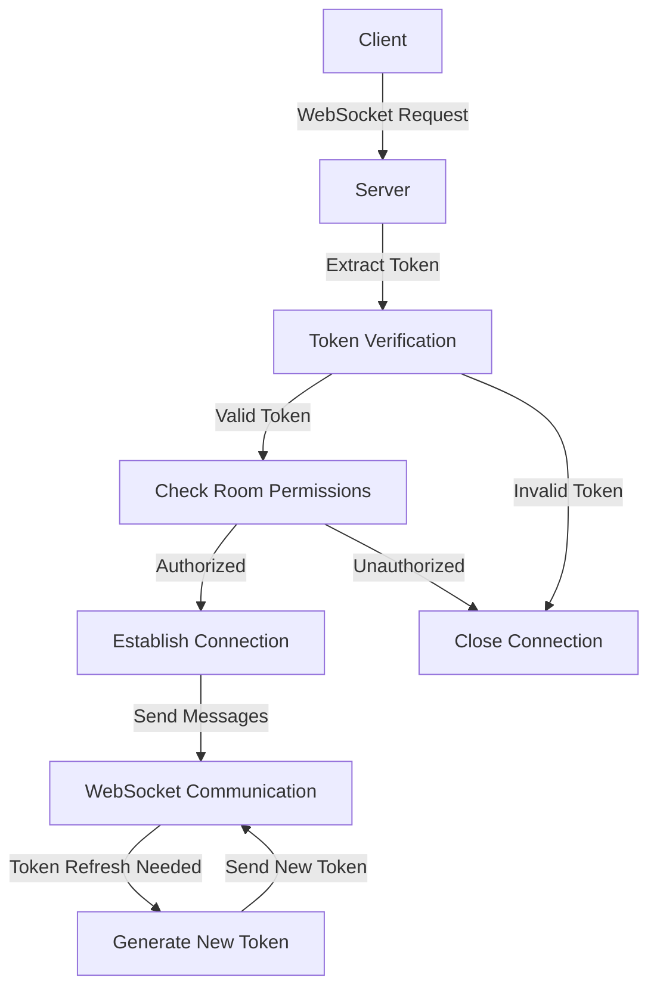

# WebSocket Authentication Improvement Plan

## Current Issues
1. Tokens are passed as query parameters, which is not secure
2. Authentication is only done at connection time
3. The system uses a simple JWT-based approach with a hardcoded secret
4. No session management or token refresh mechanism
5. No validation of room access permissions

## Performance-Focused Improvements

### 1. Secure Token Transmission
- Move from query parameters to HTTP headers for token transmission
- Add support for WebSocket protocol headers (Sec-WebSocket-Protocol)
- Implement token caching to reduce verification overhead

### 2. Optimized Authentication Flow
- Implement token refresh mechanism with short-lived access tokens
- Add support for different authentication methods (OAuth, SAML, etc.)
- Implement rate limiting to prevent brute force attacks
- Add connection pooling to reduce authentication overhead

### 3. Security Enhancements
- Implement token expiration and refresh
- Add support for different authentication methods (OAuth, SAML, etc.)
- Implement rate limiting to prevent brute force attacks
- Add support for token revocation

### 4. Monitoring and Logging
- Track authentication attempts
- Log failed authentication attempts
- Add metrics for authentication success/failure rates

## Authentication Flow Diagram

## Implementation Steps (Performance Focused)
1. Modify the WebSocket connection handler to use headers instead of query parameters
2. Implement token caching to reduce verification overhead
3. Update the auth package to support different authentication methods
4. Implement room access validation with efficient lookups
5. Add connection pooling to reduce authentication overhead
6. Implement token refresh mechanism with short-lived access tokens
7. Add monitoring and logging capabilities with minimal performance impact
