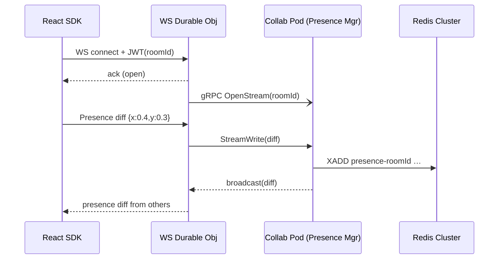

# CollabBlocks – Presence API Technical Plan (v0.1)

*Prepared April 16 2025*

---

## 1. Objective & Definition of Done
Deliver a **sub‑25 ms p95 latency Presence system** that lets clients publish their *presence state* (cursor position, avatar, status text, arbitrary metadata <2 KB) and subscribe to *others’ presence* in a room. DoD:  
* p95 RTT presence diff ≤ 40 ms (NA/EU) @ 10 k conns/room.  
* Presence converges (eventually consistent) after network partitions.  
* Redis **last seen** TTL cleanup ≤ 5 s after disconnect.

---

## 2. High‑Level Flow


---

## 3. Data Contract
```ts
interface PresenceState {
  cursor?: { x: number; y: number }; // normalised 0–1
  avatar?: string; // url
  status?: "idle" | "editing" | "commenting" | string;
  meta?: Record<string, unknown>; // <1 KB
}
```
Diffs encoded as **MsgPack** to shrink payloads (~40 % savings vs JSON).

---

## 4. Edge WebSocket Layer
* **Room Durable Object (DO):** keyed by `roomId`.  
* On **connect**: validates JWT (ES256) via `fetch('/.well-known/jwks.json')` cached 10 min. Adds socket to `set<socket>` map.
* **Broadcast**: DO writes incoming diff to `WritableStream` of gRPC to assigned collab pod. Also loops through local sock set and forwards to clients except origin.
* **Back‑pressure**: if `webSocket.bufferedAmount > 32 KB` ➜ DO pauses gRPC writes and drops diff after 1 s backlog (best‑effort semantics).

---

## 5. Collaboration Pod – Presence Manager
* Maintains `Map<roomId, PresenceShard>`.
* **PresenceShard Structure**  
  * `clients: Map<clientId, PresenceState>`  
  * `streamOffset: bigint` (Redis Streams ID processed)  
  * `lastFlushed: Date`
* **Redis Streams**  
  * Key: `presence-{roomId}`.  
  * Fields: `cid`, `msgpackDiff`, `ts`.  
  * Consumer group: `{podId}` ensures at‑least‑once cross‑pod delivery.  
  * Cap length: 1 000 items (approx 60 s history).
* **In‑memory LRU** (size 1 k) drops oldest on overflow; edge DO will request full **state sync** if LRU miss.

---

## 6. Full‑State Sync Protocol
* Triggered when new client joins or when DO re‑attaches to different pod.  
1. Edge DO sends `SYNC_REQUEST(roomId)` gRPC.  
2. Pod streams back `SnapshotChunk` messages (MsgPack array of `[clientId, PresenceState]`) in 64 KB chunks.  
3. Edge DO forwards to client; SDK merges into local store.

---

## 7. SDK Implementation (React)
```ts
const { useMyPresence, useOthers } = createPresenceHooks<PresenceState>();

export function useCursor() {
  const update = useMyPresence();
  const others = useOthers(state => state.map(o => o.cursor));
  return { cursor: others, setCursor: update };
}
```
* **Debounce**: SDK batches cursor updates at 16 ms (one animation frame).  
* **Connectivity**: On `visibilitychange` (hidden) pauses updates; resumes on focus.

---

## 8. Security & Rate Limits
* JWT claims: `sub` (userId), `room`, `exp ≤15 m`, `plan` (free/pro).  
* Edge DO rate‑limits diff input per client: 20 msg/s; bursts 5.  
* Global abuse detection: Cloudflare Bot Management + IP ban list.

---

## 9. Metrics & Observability
| Metric | Source | PromQL Example |
|--------|--------|---------------|
| `presence_rtt_ms` | SDK send→receive | histogram @ p95 |
| `presence_stream_backlog` | DO gauge | backlog > 1000 -> alert |
| `presence_redis_lag` | Pod | `XINFO GROUPS` lag |
| `presence_lru_evictions` | Pod | counter inc |

Alerts: backlog >1 k for 5 min, Redis lag >500, RTT p95 >40 ms.

---

## 10. Testing Plan
1. **Unit** – MsgPack diff encode/decode invariants.  
2. **Integration** – Simulate 100 clients, validate convergence.  
3. **Browser E2E** – Cypress with two tabs, verify live cursors <200 ms.  
4. **Load** – Artillery WS test 10 k clients @ 20 pps each.  
5. **Chaos** – Redis flushall, pod kill, verify state sync.

---

## 11. Rollout Steps
1. Deploy to *staging* namespace; shadow traffic (presence diffs only).  
2. Enable for internal QA org.  
3. 10 design partners (feature flag).  
4. Gradual rollout by plan tier.

---

## 12. Future Enhancements
* **Delta‑compression** of float positions via **H3** indexing.  
* **Selective subscription** for large rooms (>1 k) to view‑based vicinity.  
* **End‑to‑end encryption** for presence metadata.

