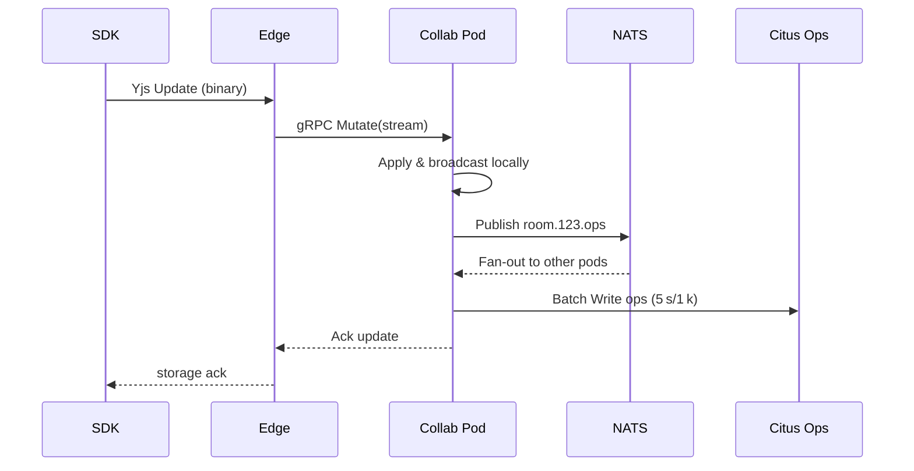

# CollabBlocks – Realtime Storage (CRDT) Technical Plan (v0.1)

*Prepared April 16 2025*

---

## 1. Objective & Definition of Done
Implement a highly‑available, conflict‑free **Realtime Storage layer** exposing `LiveList`, `LiveMap`, and `LiveObject` primitives plus rich‑text via Yjs. DoD:  
* Concurrent edits from 10 k clients converge deterministically with **no lost updates**.  
* p95 storage op round‑trip ≤ 50 ms (NA/EU).  
* Durable persistence: zero data loss under full pod crash (≤ 5 s window).  
* Query SDKs mirror Liveblocks API (`useStorage`, `useMutation`) with type‑safe TS.

---

## 2. CRDT Design
| Type | Underlying CRDT | Op Examples |
|------|-----------------|-------------|
| `LiveObject` | **LWW‑Element‑Object** (timestamp µs) | `{set: [key, val, ts]}` |
| `LiveMap` | **LWW‑Element‑Map** keyed by string | `{put: [k, v, ts]}`, `{del: [k, ts]}` |
| `LiveList` | **RGA (Replicated Growable Array)** | `{ins: [refId, elemId, payload]}`, `{del: [elemId]}` |
| Rich‑text | **Y.Text (RGAs + delta encoding)** | Yjs updates |

*Site ID (32‑bit)* + *Logical Clock (64‑bit)* tuple ensures causality ordering. Ops are encoded in **Protobuf v3**.

---

## 3. Data Flow (Happy Path)

---

## 4. Component Responsibilities
### 4.1 SDK
* **Mutation Hooks**: `useMutation(callback, deps)` returns `update(data)` which collects local ops, applies to local Yjs doc, and streams to WS buffer.  
* **Optimistic UI**: DOM updated immediately; rollback via `reversePatch` on server rejection.

### 4.2 Edge WebSocket Proxy
* Accepts binary **Yjs update** frames (type 0x02).  
* Prepends `siteId` + `logicalClock` header before gRPC streaming.

### 4.3 Collaboration Pod (CRDT Engine)
* **Op Buffer**: per room ring buffer (`Uint8Array` chunks up to 512 k).  
* **Merge Loop**:  
  1. Receive update, decode Protobuf → internal op structs.  
  2. Apply to in‑memory Y.Doc.  
  3. Broadcast diff to local sockets (MsgPack).  
  4. Publish compressed op to NATS (`room.{id}.ops`).
* **Back‑pressure**: If ring buffer >8 MB, drop oldest ops after persisting snapshot.

### 4.4 NATS JetStream
* Stream per room; **max_bytes=128 MB**, **retention=limits**, **discard=new**, **replicas=3**.  
* Pods subscribe with **deliver_policy=all**, **ack_wait=10 s**.

### 4.5 Persistence Layer
* **OpLog Table** (partitioned) stores raw Protobuf; PK `(room_id, seq)`.  
* **Snapshot Table** stores S3 URI + vector clock + content hash.  
* **Compaction Job** (AWS Batch) replays ops nightly to generate new snapshot and truncate OpLog > 30 days.

---

## 5. Snapshot Algorithm
1. Every 5 s *or* 1 k ops, `SnapshotWorker` serializes Y.Doc to binary gzip.  
2. Upload to `s3://snapshots/{roomId}/{seq}.bin`.  
3. Insert row into `snapshots` table; soft delete previous snapshot >1 h old (lifecycle rule moves to Glacier).

Restore path on pod cold start:  
* `SELECT latest snapshot` ➜ download S3 ➜ load Y.Doc ➜ fetch ops `seq > snapshot_seq` ➜ replay.

---

## 6. Conflict & Causality Handling
* **Clock Skew** tolerated via Lamport increments; if remote `logicalClock` ≤ local, increment local + 1.  
* CRDT ensures eventual convergence; list tombstones retained until nightly compaction.

---

## 7. Offline Support Hooks
* SDK stores outbound ops in **IndexedDB** (`ops_{roomId}`) with auto‑increment key.  
* On reconnect, SDK streams queued ops sequentially (preserving original LC) before live edits.

---

## 8. Security Considerations
* **Quotas**: Free tier limited to 10 MB snapshot + 1 M ops/month; enforced by Billing Worker reading ClickHouse aggregates.  
* **Schema Validation**: Protobuf decoding fails fast; any unknown field triggers reject.

---

## 9. Metrics & Observability
| Metric | Description | Target |
|--------|-------------|--------|
| `storage_op_rtt_ms` | Time from send to ack | p95 ≤ 50 ms |
| `storage_op_rate` | ops/s per room | alert > 1 k (spam) |
| `snapshot_latency_ms` | serialize & upload | p95 ≤ 120 ms |
| `oplog_lag` | PG seq − latest in memory | ≤ 200 ops |

All metrics exported via OpenTelemetry; traces sample 0.1 % high‑volume ops.

---

## 10. Testing Plan
1. **CRDT Property Tests** – Using fast‑check to generate random ops, assert convergence.  
2. **Fuzz** – AFL‑style mutation on Protobuf bytes, ensure no panic.  
3. **Partition Simulation** – tc ‑a delay 1 s drop 30 %; clients converge post restore.  
4. **Soak** – 24 h 10 M ops; monitor memory ≤ 1 GB/pod.  
5. **Restore** – Randomly kill pod, measure full restore < 2 s.

---

## 11. Rollout Strategy
* **Hidden Feature Flag** – `storage_v2`.  
* Stage: beta orgs only ➜ dual‑write to old & new storage ➜ checksum compare.  
* 25 %, 50 %, 100 % rollout in 2‑week waves.

---

## 12. Future Optimizations
* **Delta CRDT**: Delta‑state to reduce bandwidth (research).  
* **Binary‑pack Cursors** within same op frame to co‑send presence & storage diff.  
* **WebTransport** upgrade for QUIC support.

